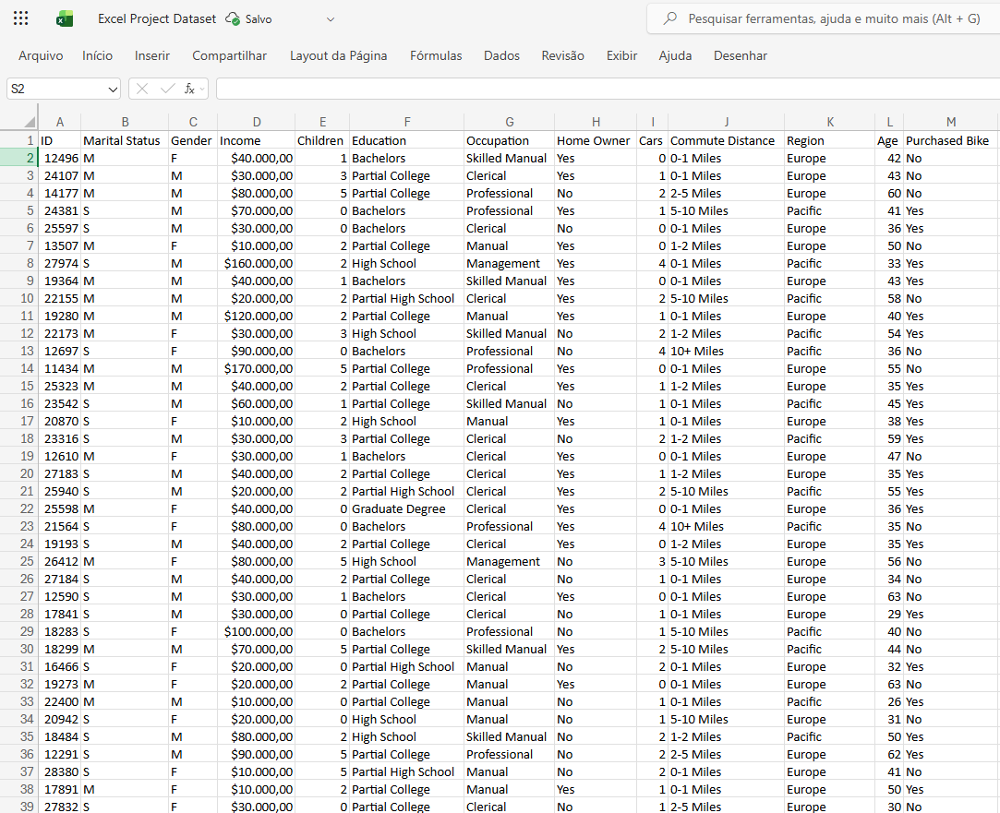
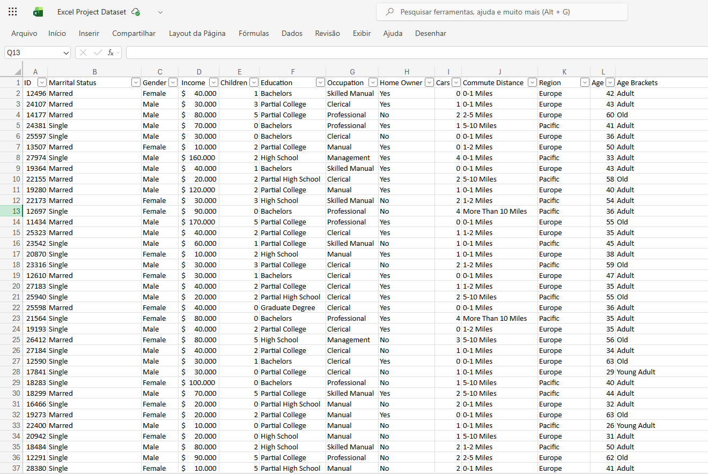
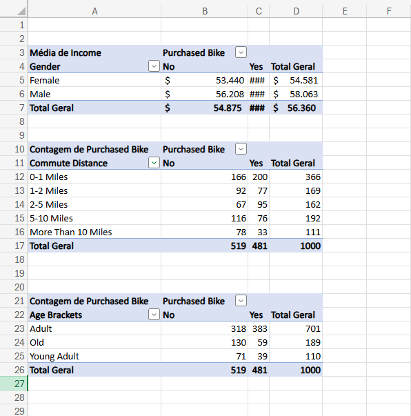
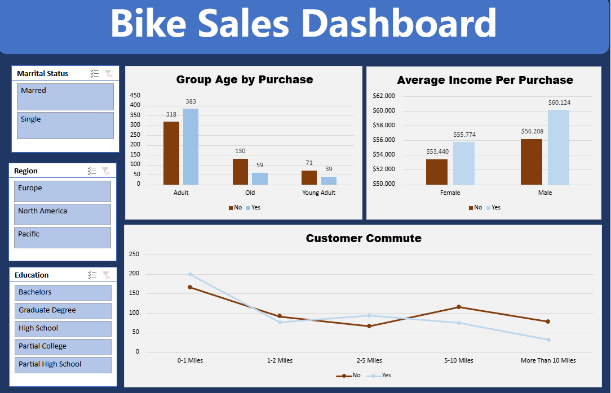

# Project Background

This project focuses on analyzing customer demographic and socioeconomic characteristics to understand bicycle purchasing behavior. The dataset captures individual-level attributes such as marital status, gender, income, age, education, occupation, home ownership, number of cars, commute distance, region, and whether a bicycle was purchased.

From a data analytics perspective, the primary goal of this project was twofold:

- Ensure analytical reliability through careful data cleaning, addressing duplicated customer records, inconsistent categorical values, missing information, and incorrect data types.
- Extract meaningful behavioral patterns associated with bicycle purchases, identifying which demographic segments, income levels, age groups, and occupations show higher purchase propensity.
- The analysis is designed to support customer segmentation, marketing strategy optimization, and data-driven decision-making, demonstrating how structured exploratory analysis can uncover actionable insights from tabular business data.

 

# Executive Summary

This analysis examines bicycle purchasing behavior using a cleaned and standardized Excel-based dataset of individual customers.
- The data shows that purchase behavior is not evenly distributed across the population. Instead, purchases are concentrated within specific age groups and occupational categories, indicating clear segmentation opportunities.
- While gender-based differences in purchasing rates exist, they are relatively small, suggesting that age, occupation, and income play a more decisive role than gender alone.
- Customers in mid-career age ranges exhibit significantly higher purchase propensity, reflecting greater purchasing power and lifestyle alignment with bicycle ownership.
- Overall, the project demonstrates how structured data cleaning combined with targeted exploratory analysis can transform a raw Excel dataset into a reliable foundation for strategic business insights.

# Data Cleaning & Preparation Overview

Before any analysis, the raw Excel dataset was loaded into a working environment and preserved in its original form to ensure data integrity. All cleaning steps were designed to reflect real-world data preparation workflows commonly used in analytics projects.

- Duplicate Detection and Removal
- Customer-level datasets are particularly prone to duplication due to repeated entries or data collection errors. To address this:
- The unique customer identifier (ID) was used to detect duplicate records.
- Duplicate rows were removed, ensuring a one-record-per-customer structure.

This step is critical for preventing biased purchase rates and inflated customer counts during aggregation.

# Standardization of Categorical Fields

Several categorical inconsistencies were addressed to improve grouping accuracy:

- Text fields were trimmed to remove hidden whitespace that could fragment categories during aggregation.
- Purchase status was standardized into a binary indicator (purchased_flag), enabling consistent numerical analysis.
- Occupation values were normalized, and missing values were imputed using the most frequent category when analytically justified.

These steps directly impact the reliability of all subsequent GROUP BY operations used in the EDA.

# Data Type Corrections

Key numerical fields required transformation:

- Income values were converted from text into numeric format by removing currency symbols and separators.
- Age was coerced into numeric format, enabling age-based segmentation and binning.
- Without these transformations, meaningful statistical aggregation would not be possible.

# Handling Missing and Incomplete Data

Rows lacking purchase information were removed, as they provide no analytical value for understanding buying behavior and could distort purchase-rate calculations.
This approach prioritizes analytical clarity over raw data volume, a common trade-off in real-world analytics.

# Final Dataset Structure

After cleaning, the dataset represents a high-integrity customer-level table, where each row corresponds to a unique individual with standardized demographic attributes and a clearly defined purchase outcome. This structure supports reliable analysis across:

- Demographics
- Income levels
- Age groups
- Occupations
- Geographic regions

 

# Exploratory Data Analysis

## Overall Purchase Behavior

- Approximately 48% of customers purchased a bicycle, indicating a balanced dataset suitable for behavioral analysis.
This confirms that purchasing is neither rare nor universal, making segmentation meaningful.

## Purchase Behavior by Gender

- Purchase rates between genders are similar, with a slight advantage for female customers.
This suggests that gender alone is not a strong discriminator, and more granular demographic variables are needed.

## Age-Based Purchasing Patterns

- Customers aged 35–44 exhibit the highest purchase rate, significantly outperforming both younger and older groups.
- Purchase propensity declines after age 55, indicating a life-stage effect rather than a linear age relationship.
- Age grouping reveals that bicycle purchasing is strongly associated with mid-career and family-oriented demographics.

## Income and Purchasing Propensity

When income is grouped into quantiles, purchase rates vary across income levels.
This highlights income as a relevant—but not exclusive—driver of purchasing behavior.

## Occupational Concentration

- A small number of occupational categories account for a disproportionate share of total purchases.
- Professional and skilled manual workers dominate purchase counts, reflecting both income stability and lifestyle alignment.
This concentration indicates that headline purchase volumes are driven by specific customer segments rather than uniform behavior across all occupations.

# Strategic Insights

- Bicycle purchases are concentrated within specific age and occupational groups.
- Gender differences exist but are relatively minor compared to age and occupation effects.
- Mid-career customers represent the highest-value segment in terms of purchase propensity.
- Clean, standardized customer data is essential for producing reliable behavioral insights.

